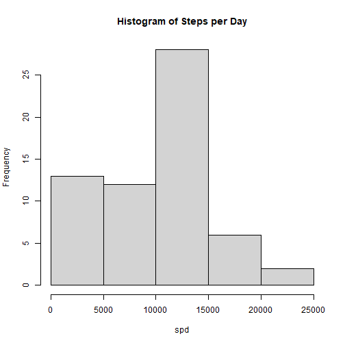
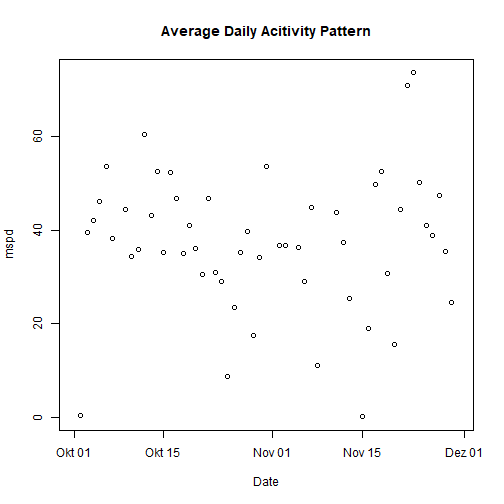
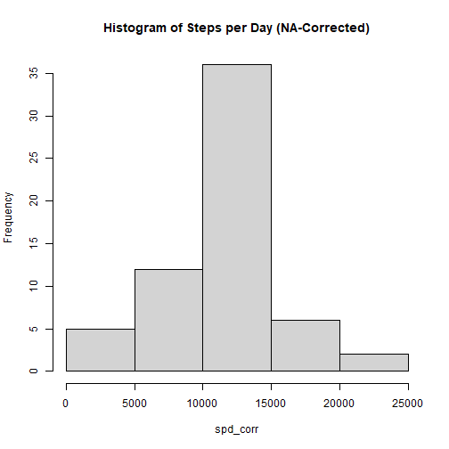
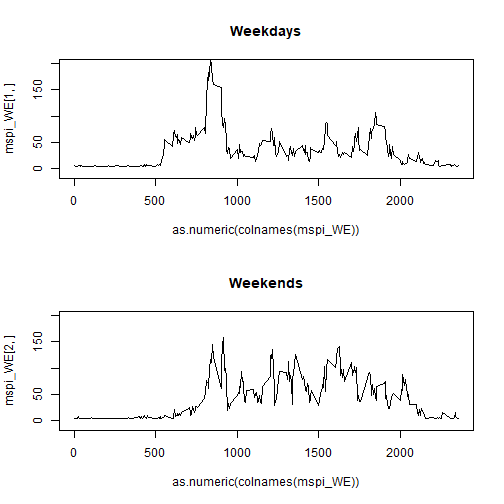

# Less5W2 Programming Assignment

## Step 1: Load Data
Load data and convert date-string into "date"-class

```r
    activity <- read.csv("activity.csv")
    activity$date <- as.Date(activity$date, "%Y-%m-%d")
```

## Step 2: What is mean total number of steps taken per day ("mspd")

```r
    spd <- tapply(activity$steps, activity$date, sum, na.rm = TRUE)
```


```r
    hist(spd, main = "Histogram of Steps per Day")
```




```r
    mean_spd <- mean(spd, na.rm = TRUE)
    print(mean_spd)
```

```
## [1] 9354.23
```

```r
    median_spd <- (median(spd, na.rm = TRUE))
    print(median_spd)
```

```
## [1] 10395
```

## Step 3: What is the average daily activity pattern


```r
    mspd <- tapply(activity$steps, activity$date, mean, na.rm = TRUE)
    plot(as.Date(names(mspd)), mspd, main = "Average Daily Acitivity Pattern", xlab = "Date")
```



## Step 4 Imputing missing data

```r
    NAs <- sum(is.na(activity$steps))
    print(paste("Total number of rows with NAs:", NAs))
```

```
## [1] "Total number of rows with NAs: 2304"
```
For rows containing NAs, replace NA with average interval activity (global):

```r
    activity_NA_Imp <- activity
    NA_ind <- which(is.na(activity$steps))
    for (i in NA_ind){
        activity_NA_Imp$steps[i] <- mean(activity$steps, na.rm = TRUE)
    }
```

Use "corrected" data to repeat Step 2:

```r
    spd_corr <- tapply(activity_NA_Imp$steps, activity_NA_Imp$date, sum, na.rm = TRUE)
```


```r
    hist(spd_corr, main = "Histogram of Steps per Day (NA-Corrected)")
```



```r
    mean_spd_corr <- mean(spd_corr, na.rm = TRUE)
  
    
    median_spd_corr <- (median(spd_corr, na.rm = TRUE))
  
    
    m <- matrix(c(mean_spd, mean_spd_corr, median_spd, median_spd_corr), nrow=2, ncol =2)
    row.names(m) <- c ("origial", "corrected")
    colnames(m) <- c ("mean", "median")
    print(m)
```

```
##               mean   median
## origial    9354.23 10395.00
## corrected 10766.19 10766.19
```


## Step 5 Resolve Statistics for Weekends / Weekdays


```r
  activity_NA_Imp$WE <- vector(length = length (activity_NA_Imp$date))
  vec_WE <- which(weekdays(activity_NA_Imp$date, abbreviate = TRUE) == "Sa" | 
    weekdays(activity_NA_Imp$date, abbreviate = TRUE) == "So")
for (i in vec_WE){
  activity_NA_Imp$WE[i] <- TRUE
}
  ##average steps per interval for Weekends and Weekdays
  mspi_WE <- tapply(activity_NA_Imp$steps, list(activity_NA_Imp$WE, activity_NA_Imp$interval), mean )
  par(mfrow = c(2,1))
  plot(as.numeric(colnames(mspi_WE)), mspi_WE[1,], main = "Weekdays", type = "l", ylim = c(-10,200))
  plot(as.numeric(colnames(mspi_WE)), mspi_WE[2,], main = "Weekends", type = "l", ylim = c(-10,200))
```



